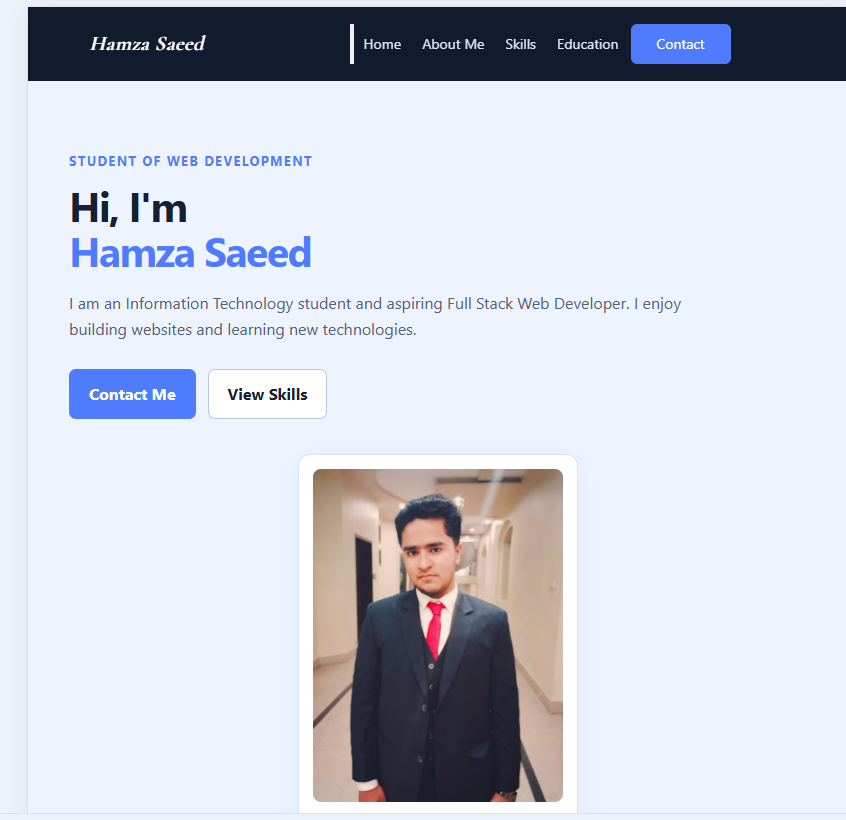
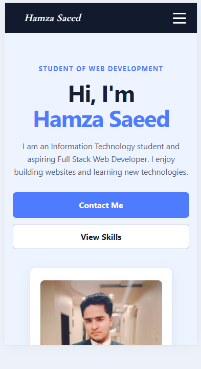

# Aurex Web Internship - Week 2

## Intern Details

**Name:** Hamza Saeed
**Domain:** Web Development
**Week:** Week 2

## Task Description

For Week 2 of my web development internship, I improved my Week 1 personal profile webpage by applying CSS3 styling and modern layout techniques.

The webpage was transformed from a basic HTML profile page into a responsive and professional personal portfolio webpage.

The website includes a navigation bar, Home section, About Me section, Skills section, Education section, Contact section with a form, and Footer.

The main purpose of this task was to practice CSS fundamentals, the CSS Box Model, Flexbox, CSS Grid, responsive web design, media queries, and basic UI/UX principles.

## Technologies Used

* HTML5
* CSS3
* Git
* GitHub
* Vercel

## Live Deployment

**Live Website:** [personal-portfolio-hamza.vercel.app](https://personal-portfolio-hamza.vercel.app)

## CSS Features & Layout Techniques

The following CSS concepts and techniques were implemented:

* CSS selectors
* Colors and backgrounds
* Typography and text styling
* CSS Box Model
* Margin and padding
* Borders and border-radius
* Flexbox
* CSS Grid
* Element positioning
* Responsive Web Design
* CSS Media Queries
* Mobile-first approach
* Responsive navigation
* Responsive contact form
* Consistent spacing and alignment
* Basic UI/UX principles

## Screenshots

### Desktop View

### Tablet View

### Mobile View

## Key Learnings

During this task, I learned and practiced:

* Applying CSS to an existing HTML webpage.
* Understanding and using the CSS Box Model.
* Using Flexbox to align and arrange elements.
* Using CSS Grid to create structured layouts.
* Creating responsive layouts using Media Queries.
* Designing webpages for desktop, tablet, and mobile screens.
* Improving typography, spacing, colors, and alignment.
* Understanding basic UI/UX principles.
* Using CSS to create a cleaner and more professional webpage.
* Managing and updating project files using Git and GitHub.

## Challenges / Blockers

One of the main challenges was making the webpage responsive across different screen sizes.

I had to adjust layouts, spacing, typography, navigation, and form elements so that the webpage remained easy to use on desktop, tablet, and mobile devices.

Another challenge was understanding when to use Flexbox and CSS Grid for different parts of the webpage.

Working through these challenges helped me better understand responsive web design and modern CSS layout techniques.

## Requirements Checklist

* [x] CSS3 styling implemented
* [x] CSS Box Model used
* [x] Flexbox implemented
* [x] CSS Grid implemented
* [x] Responsive design implemented
* [x] Media Queries implemented
* [x] Desktop layout tested
* [x] Tablet layout tested
* [x] Mobile layout tested
* [x] Basic UI/UX principles applied
* [x] Website deployed on Vercel
* [x] Live deployment link added
* [x] Desktop screenshot added
* [x] Tablet screenshot added
* [x] Mobile screenshot added

## How to Run the Project Locally

1. Clone the repository:

git clone https://github.com/itshamza0409/aurex-web-internship-week2-Hamza.git

2. Open the project folder.

3. Open `index.html` in any web browser.

No additional installation or setup is required.

## Project Structure

aurex-web-internship-[name]/
├── index.html
├── style.css
├── README.md
├── desk.PNG
├── tab.PNG
└── mobile.PNG

## Conclusion

Week 2 helped me strengthen my CSS fundamentals and understand how modern CSS layout techniques can be used to create responsive and visually consistent webpages.

I also gained practical experience in making a webpage adapt to different screen sizes and improving the overall user interface.
